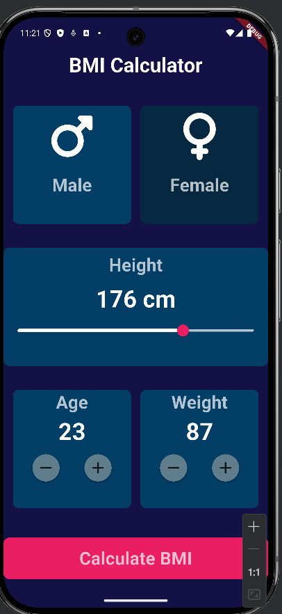
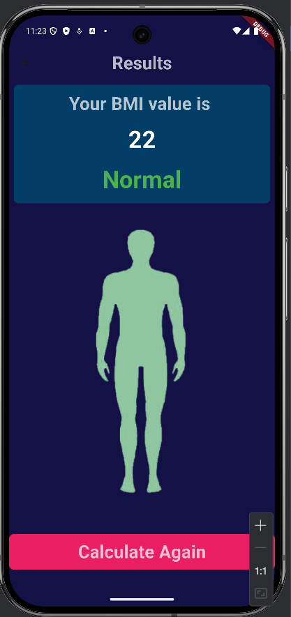
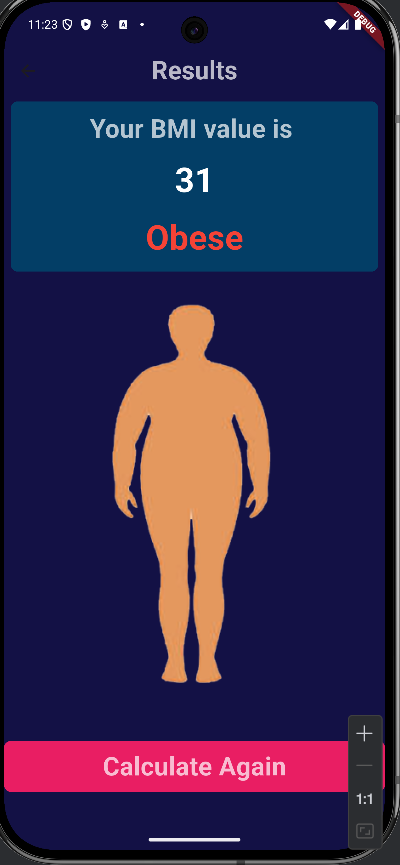
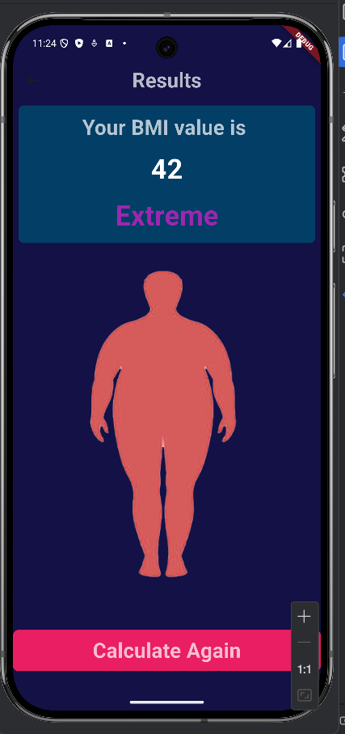
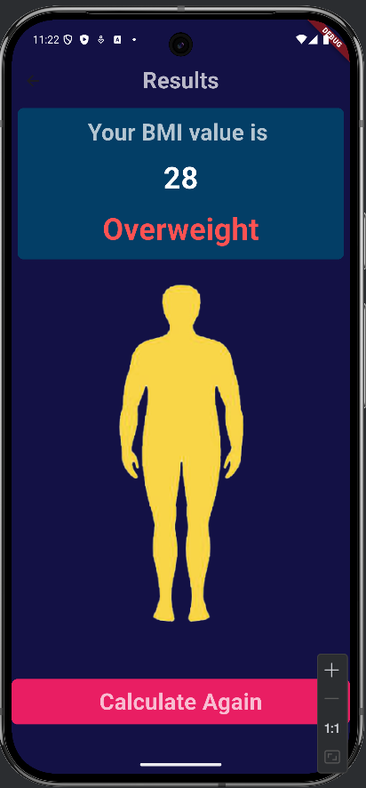

## Preview

## Features

# Enter height & weight using sliders

# Calculates BMI instantly

# Categorizes your result: Underweight, Normal, Overweight, etc.

# Clean and interactive UI

# Built with Flutter (Android/iOS support)